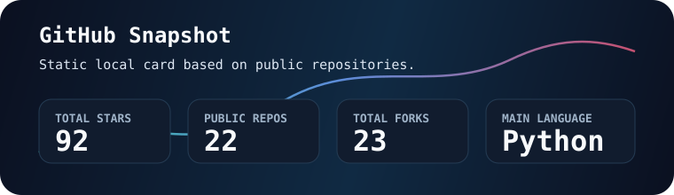

<p align="center">
  <a href="https://github.com/zhangzhanglaila">
    
  </a>
</p>

<h1 align="center">Hi, I'm zhangzhanglaila</h1>
<h3 align="center">AI Agent Builder | Python Developer | Creative Tool Maker</h3>

<p align="center">
  <a href="https://github.com/zhangzhanglaila?tab=followers">
    
  </a>
  <a href="https://github.com/zhangzhanglaila?tab=repositories">
    
  </a>
  <a href="https://github.com/zhangzhanglaila">
    
  </a>
</p>

<p align="center">
  <a href="https://git.io/typing-svg">
    
  </a>
</p>

## Profile Overview

- I build AI-driven tools for video, music, media management, and interactive products.
- Recent work includes AI video montage, lyric generation from chat records, local photo management, and playable game prototypes.
- I care about tools that are practical, local-first where possible, and easy to extend.
- Based in Wuhan.

## Tech Stack

<p align="center">
  
  
  
  
  
  
  
  
  
  
  
  
  
</p>

<p align="center">
  
  
  
  
</p>

## GitHub Stats

<p align="center">
  
</p>

## Contribution Snake

<p align="center">
  <picture>
    <source media="(prefers-color-scheme: dark)" srcset="https://raw.githubusercontent.com/zhangzhanglaila/zhangzhanglaila/output/github-contribution-grid-snake-dark.svg" />
    <source media="(prefers-color-scheme: light)" srcset="https://raw.githubusercontent.com/zhangzhanglaila/zhangzhanglaila/output/github-contribution-grid-snake.svg" />
    
  </picture>
</p>

## Focus

```text
AI Agent          Create autonomous workflows for media and productivity
Video Automation  Detect scenes, sync music, cut clips, and render outputs
Local-first Apps  Keep useful tools close to the user's own files
Creative Systems  Build small products that feel complete and usable
```
